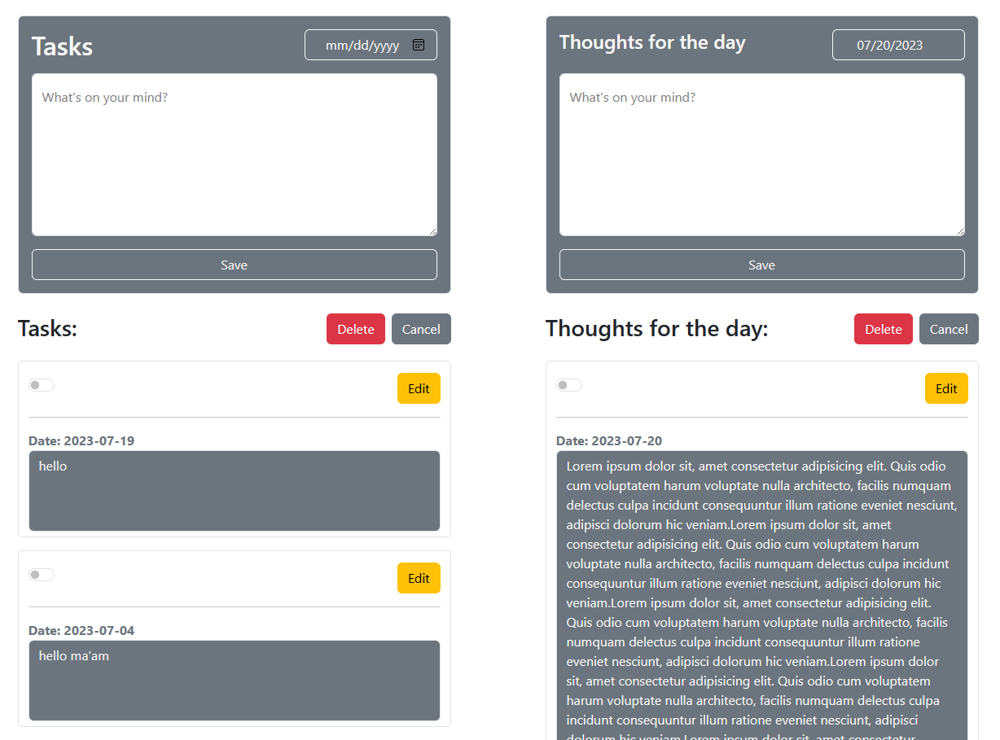

# Sample

# Thoughts and Tasks App

## Description

Thoughts and Tasks is a web application that allows users to jot down their daily thoughts and tasks in a user-friendly interface. The app is built using React.js and Bootstrap, providing a modern and responsive design.

## Features

- Add and save your daily thoughts with dates.
- Manage tasks by adding, editing, and deleting them.
- Easy-to-use interface with floating labels for input fields.
- Select and delete multiple tasks at once.
- Persistent data storage using local storage.

## Technologies Used

- React.js
- Bootstrap
- MDB React UI Kit
- SweetAlert2

## Getting Started

1. Clone the repository: `git clone https://github.com/your-username/thoughts-and-tasks.git`
2. Install dependencies: `npm install`
3. Run the app: `npm start`

## Usage

1. **Thoughts**: Enter your thoughts for the day in the provided textarea and select the date from the date picker. Click the "Save" button to save your thoughts.
2. **Tasks**: Add your daily tasks by typing them in the textarea and selecting the date. Click "Save" to add a task. To edit or delete a task, use the "Edit" and "Delete" buttons.

## Contributions

Contributions are welcome! If you find any issues or have suggestions for improvement, feel free to open an issue or submit a pull request.
